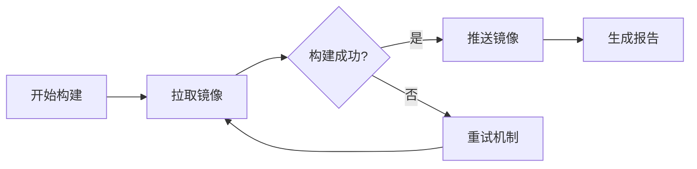

# 🐳 Ali_ACR_Pusher

<div align="center">


[](https://opensource.org/licenses/Apache-2.0)


</div>

📦 自动化 Docker 镜像同步工具，用于将 Docker Hub 或其他镜像仓库的镜像同步到阿里云容器镜像服务。支持批量处理、错误重试、邮件通知等功能。

## ✨ 主要特性

### 🔄 1. 自动化镜像同步
- 📦 支持批量镜像同步处理
- 🏷️ 自动处理镜像标签和命名空间
- 🌍 支持多平台架构镜像
- 🔀 智能处理重名镜像冲突

### 🛠️ 2. 错误处理和重试
- 🔁 自动重试失败操作（最多3次）
- ⏰ 采用指数退避重试策略
- 📝 详细的错误信息记录
- 🔍 完整的错误追踪和通知

### 📊 3. 状态监控和可视化
- 📈 GitHub Actions 状态徽章
- ⏳ 实时构建进度展示
- 📑 详细的统计信息
- ✅ 清晰的成功/失败状态展示

### 📧 4. 邮件通知
- 📨 自动发送构建结果通知
- 🎨 HTML 格式的详细报告
- 📊 包含完整的构建统计
- ⚠️ 错误详情自动通知

## 🚀 开始使用

### 📋 环境要求
| 要求 | 说明 |
|------|------|
|  | GitHub 账号 |
|  | 阿里云容器镜像服务账号 |
|  | Gmail 账号（用于通知） |

### ⚙️ 配置步骤

#### 1️⃣ Fork 本仓库

#### 2️⃣ 设置 GitHub Secrets
```yaml
# 阿里云配置
ALIYUN_REGISTRY: 阿里云镜像仓库地址
ALIYUN_NAME_SPACE: 阿里云命名空间
ALIYUN_REGISTRY_USER: 阿里云账号
ALIYUN_REGISTRY_PASSWORD: 阿里云密码

# Gmail 配置
GMAIL_USERNAME: Gmail 邮箱地址
GMAIL_PASSWORD: Gmail 应用专用密码
```

#### 3️⃣ 配置镜像列表
编辑 `images.txt` 文件，添加需要同步的镜像：
```bash
# 🛠️ Jenkins 基础镜像
jenkins/jenkins:2.426.1-lts-jdk11

# 🎮 Unity 构建环境
unityci/editor:2023.2.9f1-linux-il2cpp-2.0

# 🐋 带平台标识的镜像示例
--platform linux/amd64 mysql:8.0
```

#### 4️⃣ 触发同步
| 触发方式 | 说明 |
|---------|------|
| 🖱️ 手动触发 | 通过 GitHub Actions 页面 |
| 🔄 自动触发 | 推送到 master 分支 |
| ⏰ 定时触发 | 每天凌晨 1 点 |

## 🛠️ 详细配置

### 📝 镜像配置说明
- 🌍 支持指定平台架构（使用 --platform 参数）
- 📑 支持注释（以 # 开头的行）
- 🔗 支持完整的镜像路径
- 🔀 自动处理命名空间冲突问题

### ⚙️ 工作流配置
| 配置项 | 说明 |
|--------|------|
| 🔄 触发方式 | 手动、推送、定时 |
| 💻 运行环境 | Ubuntu latest |
| 💾 空间优化 | 自动磁盘管理 |
| 🛡️ 错误处理 | 完整重试机制 |

### 📧 邮件通知配置
| 配置项 | 值 |
|--------|-----|
| 📡 服务器 | smtp.gmail.com |
| 🔌 端口 | 587 |
| 🎨 格式 | HTML |
| 📊 内容 | 状态、统计、错误信息 |

## 🔧 高级特性

### ⚡ 重试机制
```yaml
🔄 最大重试：3次
⏱️ 等待时间：10s, 20s, 40s（指数退避）
📝 错误处理：详细日志记录
```

### 📊 构建报告


### 💾 磁盘空间管理
| 配置项 | 值 |
|--------|-----|
| 💽 保留空间 | 2048MB |
| 🔄 交换空间 | 128MB |
| 🧹 自动清理 | dotnet, haskell |

## ❓ 常见问题

### 🤔 Q1: 如何添加新镜像？
> 直接编辑 `images.txt` 文件，按格式添加镜像配置。支持注释和平台标识。

### 📧 Q2: 如何配置 Gmail？
1. 🔑 登录 Google 账号设置
2. 🔒 开启两步验证
3. 🎫 生成应用专用密码
4. ⚙️ 配置到 GitHub Secrets

### ❌ Q3: 构建失败怎么办？
1. 📧 查看邮件通知中的错误信息
2. 📝 检查 GitHub Actions 日志
3. ✅ 验证镜像配置格式
4. 🔑 确认 Secrets 配置正确

## 🤝 参与贡献

欢迎提交 PR 或 Issue！请确保：
1. 📝 代码风格统一
2. 💭 添加必要注释
3. 📚 更新相关文档
4. ✅ 测试功能正常

## 📄 开源协议

本项目采用 [Apache License 2.0](LICENSE) 开源协议。根据协议，您可以自由地：
- ✅ 使用本项目进行商业用途
- ✅ 修改和分发本项目的代码
- ✅ 私有使用不受限制

但您必须：
- ⚠️ 保留原始的版权声明
- ⚠️ 在修改后的文件中说明修改内容
- ⚠️ 在您的项目中包含一份 Apache License 2.0 协议的副本

## 📞 联系方式

- 💬 Issues：[GitHub Issues](https://github.com/Tianyuyuyuyuyuyu/Ali_ACR_Pusher/issues)
- 📧 邮件：[tianyulovecars@gmail.com]

## 📝 更新日志

### 🎉 v1.0.0 (2024-01-20)
- ✨ 完整的自动化同步功能
- 🔄 错误重试机制
- 📧 邮件通知系统
- 📊 构建状态可视化

---
<div align="center">
Made with ❤️ by Tianyu
</div>
